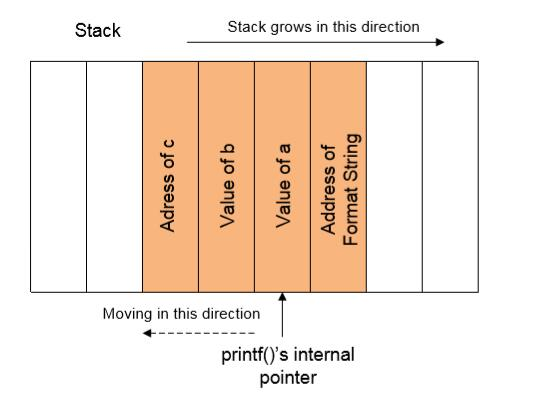
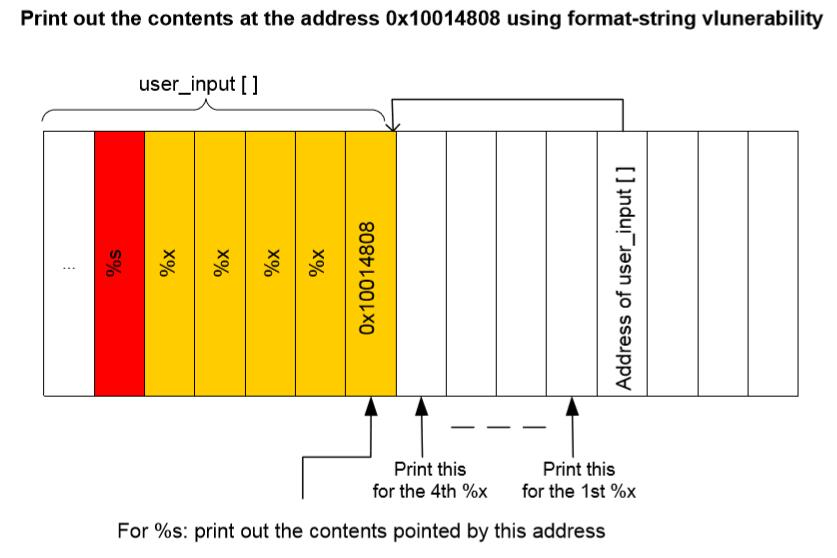

# 七、格式化字符串漏洞

> 原文：[Format String Vulnerability](http://www.cis.syr.edu/~wedu/Teaching/CompSec/LectureNotes_New/Format_String.pdf)

> 译者：[飞龙](https://github.com/wizardforcel)

```c
printf ( user_input );
```

上面的代码在 C 程序中十分常见。这一章中，我们会发现如果程序使用权限运行（例如 Set-UID 程序），可能造成什么问题。

## 1 格式化字符串

+   什么是格式化字符串？

    ```c
    printf ("The magic number is: %d\n", 1911);
    ```
    
    被打印的文本是`The magic number is:`，后面是格式化参数`%d`。它在输出中由参数 1911 替换。因此输出是这样：`The magic number is: 1911`。除了`%d`，还有几种其它的格式化参数，每种都有不同的含义。下面的表格总结了这些格式化参数：
    
    ```
    参数 含义 传递方式
    ------------------------------------------
    %d 十进制 (int) 传值 
    %u 无符号十进制 (unsigned int) 传值 
    %x 十六集进制 (unsigned int) 传值 
    %s 字符串 ((const) (unsigned) char *) 传址 
    %n 目前为止写入的字符数 (* int) 传址
    ```
    
+   栈和它在格式化字符串中的作用

    格式化函数的行为格式化字符串控制。函数从栈上获取由格式化字符串请求的参数。
    
    ```c
    printf ("a has value %d, b has value %d, c is at address: %08x\n", a, b, &c);
    ```
    
    
    
+   如果格式化字符串和实际参数之间不匹配，会如何？

    ```c
    printf ("a has value %d, b has value %d, c is at address: %08x\n", a, b);
    ```
    
    +   在上面的例子中，格式化字符串请求三个参数，但是程序实际上提供了两个（也就是`a`和`b`）。
    +   这个可以通过编译器嘛？
        +   函数`printf`定义为参数长度可变的函数。因此，通过查看参数数量，一切都正常。
        +   为了寻找不匹配，编译器需要理解`printf`如何工作，以及格式化字符串是什么意思。但是，编译器不会做这种分析。
        +   有时，格式化字符串不是个字符串常量。它在程序执行期间生成。因此，这里编译器没有办法发现不匹配。
    +   `printf`可能检测不匹配吗？
        +   函数`printf`从栈上获取参数。如果格式化字符串需要三个参数，它会从栈上获取三个参数。除非栈上存在标记，`printf`不知道它超出了提供给它的参数范围。
        +   由于不存在标记，`printf`会继续从栈上抓取数据。在不匹配的情况下，它会抓取一些不属于这个函数调用的数据。
        
## 2 格式化字符串漏洞攻击

+   使程序崩溃
    
    ```c
    printf ("%s%s%s%s%s%s%s%s%s%s%s%s");
    ```
    
    +   对于每一个`%s`，`printf`会从栈上抓取一个数值，将其看做地址，并将由该地址指向的内存内容打印为字符串，直到遇到了空字符（数值 0 而不是字符 0）。
    +   由于`printf`抓取的数值可能不是有效地址，由该数值指向的内存可能不存在（也就是没有物理内存赋给这个地址），程序就会崩溃。
    +   也可能数值碰巧是有效地址，但是地址空间被保护了（也就是为内核空间预留）。这样的话，程序也会崩溃。
+   查看栈
    
    ```c
    printf ("%08x %08x %08x %08x %08x\n");
    ```
    
    +   这让`printf`函数从栈上获取五个参数，并将其展示为填充长度为 8 的十六进制数值。所以输出可能为：
    
        ```
        40012980 080628c4 bffff7a4 00000005 08059c04
        ```
+   查看任何地址的内存
    +   我们需要提供内存地址。但是我们不能修改代码，我们只能提供格式化字符串。
    +   如果我们使用`printf(%s)`，而不指定内存地址，`printf`就会从栈上获取目标地址。函数维护了初始的栈指针，所以它知道栈上参数的位置。
    +   观察：格式化字符串通常位于栈上。如果我们可以将目标地址编码在格式化字符串中，目标地址就能在栈上。下面的示例中，格式化字符串储存在缓冲区中，它位于栈上。
    
        ```c
        int main(int argc, char *argv[]) { 
            char user_input[100]; 
            ... ... /* other variable definitions and statements */
            
            scanf("%s", user_input); /* getting a string from user */ 
            printf(user_input); /* Vulnerable place */
            
            return 0;
        }
        ```
    
    +   如果我们可以让`printf`从格式化字符串获取地址（也位于栈上），我们就可以控制该地址。
    
        ```c
        printf ("\x10\x01\x48\x08 %x %x %x %x %s");
        ```
        
    +   `\x10\x01\x48\x08`是目标地址的四个字节。在 C 语言中，`\x10`让编译器将十六进制值 0x10 放入当前位置。这个值只占一个字节。如果我们不使用`\x`，直接将 10 放入字符串，就会储存 ASCII 值 1 和 0。它们的 ASCII 值是 49 和 48。
    +   `%x`让栈指针沿着格式化字符串移动。
    +   这里是攻击方式，如果`user_input`包含下面的格式化字符串：
    
        ```
        "\x10\x01\x48\x08 %x %x %x %x %s"
        ```
        
        
        
    +   本质上，我们使用四个`%x`来使`printf`的指针，向我们储存在格式化字符串中的地址移动。一旦到达了目标，我们就会像`printf`提供`%s`，使其打印出地址` 0x10014808`的内容。函数`printf`会将内存看做字符串，并打印出来，知道到达了字符串尾部（空字符）。
    +   `user_input`和传给`printf`函数的地址之间的栈空间并不是`printf`的。但是，由于程序中的格式化字符串漏洞。`printf`将它们看做匹配格式化字符串中`%x`的参数。
    +   这个攻击的关键就是弄清楚`user_input`和传给`printf`的地址的距离。这个距离决定了在提供`%s`之前，你需要向格式化字符串插入多少个`%x`。
+   在进程的内存中向任何地址写入整数
    +   `%n`：目前为止写入的字符数量，储存在一个整数中，它由相应参数表示。
    
        ```c
        int i; 
        printf ("12345%n", &i);
        ```
        
    +   它使`printf`将 5 写入变量`i`。
    +   使用查看任意地址内存的相同方式，我们可以使`printf`将整数写入任意地址。只需要将上面例子中的`%s`替换为`%n`，就会覆盖` 0x10014808`地址处的内容。
    +   使用这个攻击，攻击者可以做这些事情：
        +   覆盖控制访问权限的重要程序标志位
        +   覆盖栈上的返回地址，函数指针，以及其他
    +   但是，写入的值由`%n`之前已打印的字符数量决定。是否真的可以写入任意整数呢？
        +   使用伪造的输出字符。为了写入值 1000，应该事先打印 1000 个伪造字符的间隔。
        +   为了避免过长的格式化字符串，我们可以使用格式化标志的宽度限定。
+   预防措施
    +   地址空间随机化：就像用于保护缓冲区溢出攻击的预防措施那样，地址空间随机化攻击者难以找到他们想要读取或写入什么地址。（译者注：但是仍然有一些区域无法随机化，比如 PLT）。
